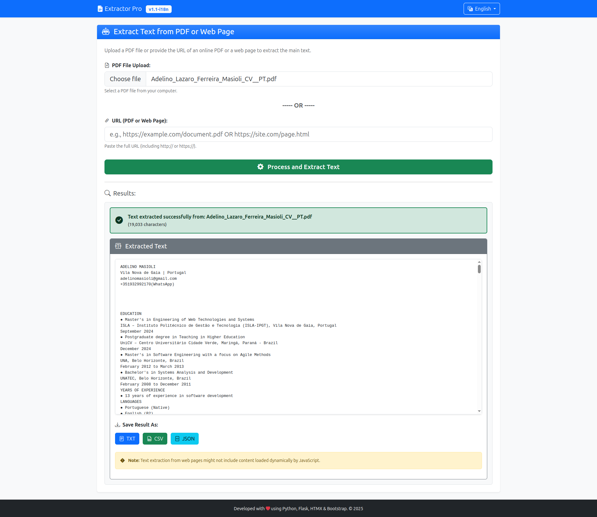

# Extractor Pro 📄🔗เว็บ Extrator de Texto (PDF & URL)

[](https://www.python.org/) [](https://flask.palletsprojects.com/) [](https://opensource.org/licenses/MIT) **Extraia texto de ficheiros PDF (locais ou via URL) e de páginas web HTML com facilidade!**

Esta aplicação web, construída com Flask e HTMX, oferece uma interface limpa e responsiva para carregar ficheiros PDF ou fornecer URLs (apontando para PDFs ou páginas HTML) e extrair o conteúdo textual principal. Os resultados podem ser visualizados diretamente ou descarregados nos formatos TXT, CSV ou JSON. A aplicação também suporta múltiplos idiomas (Português, Inglês, Espanhol).

---

## ✨ Funcionalidades Principais

* **Extração de PDF Local:** Faça upload de ficheiros PDF diretamente do seu computador.
* **Extração de URL:** Forneça URLs que apontem para:
    * Ficheiros PDF online.
    * Páginas web HTML.
* **Visualização Direta:** Veja o texto extraído diretamente na interface web.
* **Opções de Download:** Guarde o texto extraído como ficheiro `.txt`, `.csv` ou `.json`.
* **Interface Moderna:** Layout limpo e responsivo usando Bootstrap 5.
* **Interação Dinâmica:** Atualizações parciais da página sem recarregamento total, graças ao HTMX.
* **Multi-idioma:** Suporte para Português 🇵🇹, Inglês 🇬🇧 e Espanhol 🇪🇸, com seleção de idioma.
* **Tratamento de Erros:** Validação de inputs e tratamento de erros durante o processamento e extração.

---

## 📸 Screenshot


*(Nota: Ajuste o caminho para a imagem conforme a estrutura do seu repositório)*

---

## 🛠️ Tecnologias Utilizadas

* **Backend:**
    * [Python](https://www.python.org/) (3.8+)
    * [Flask](https://flask.palletsprojects.com/) (Framework Web)
    * [PyMuPDF (fitz)](https://github.com/pymupdf/PyMuPDF) (Extração de texto PDF)
    * [Requests](https://requests.readthedocs.io/) (Requisições HTTP para URLs)
    * [Beautiful Soup 4 (bs4)](https://www.crummy.com/software/BeautifulSoup/bs4/doc/) (Parseamento de HTML)
    * [lxml](https://lxml.de/) (Parser HTML/XML para BeautifulSoup)
    * [Flask-Babel](https://github.com/python-babel/flask-babel) (Internacionalização - i18n)
    * [python-dotenv](https://github.com/theskumar/python-dotenv) (Gestão de variáveis de ambiente)
* **Frontend:**
    * [HTML5](https://developer.mozilla.org/en-US/docs/Web/Guide/HTML/HTML5)
    * [Bootstrap 5](https://getbootstrap.com/) (Framework CSS)
    * [HTMX](https://htmx.org/) (Interação dinâmica sem JavaScript complexo)
    * CSS3

---

## 📋 Pré-requisitos

Antes de começar, certifique-se de que tem o seguinte instalado no seu sistema:

* **Python:** Versão 3.8 ou superior.
* **pip:** O gestor de pacotes do Python (geralmente vem com o Python).
* **Virtualenv (ou venv):** Ferramenta para criar ambientes virtuais isolados (o módulo `venv` vem com Python 3.3+).
* **(Opcional, para Desenvolvimento i18n):** Ferramentas `gettext` da GNU instaladas no sistema. Necessário para extrair e compilar traduções com `pybabel`.
    * No Ubuntu/Debian: `sudo apt-get update && sudo apt-get install gettext`
    * No macOS (usando Homebrew): `brew install gettext` e `brew link gettext --force`
    * No Windows: Pode ser mais complexo; considere usar WSL ou encontrar binários `gettext` para Windows.

---

## 🚀 Instalação e Configuração

Siga estes passos para configurar e executar a aplicação localmente:

1.  **Clonar o Repositório (ou Descarregar os Ficheiros):**
    ```bash
    git clone <URL_DO_SEU_REPOSITORIO> # Se estiver no Git
    cd <pasta-do-projeto>
    ```

2.  **Criar e Ativar um Ambiente Virtual:**
    (Recomendado para isolar as dependências)
    ```bash
    # Criar o ambiente (ex: chamado 'myenv')
    python -m venv myenv

    # Ativar o ambiente
    # Linux / macOS:
    source myenv/bin/activate
    # Windows (Cmd/PowerShell):
    # myenv\Scripts\activate
    ```
    *Você deverá ver `(myenv)` no início do prompt do seu terminal.*

3.  **Instalar Dependências:**
    ```bash
    pip install -r requirements.txt
    ```

4.  **Configurar Variáveis de Ambiente:**
    * Crie um ficheiro chamado `.env` na raiz do projeto.
    * Abra o ficheiro `.env` e adicione uma chave secreta para o Flask (essencial para sessões). Gere uma chave segura executando no terminal `python -c "import secrets; print(secrets.token_hex(24))"` e cole o resultado:
        ```dotenv
        # .env
        FLASK_SECRET_KEY='SUA_CHAVE_SECRETA_GERADA_AQUI'
        ```

5.  **Configurar Traduções (Internacionalização - i18n):**
    * **Extrair Strings:** Gere o ficheiro modelo `.pot` com todas as strings marcadas para tradução:
        ```bash
        # Certifique-se que o ambiente virtual está ativo
        pybabel extract -F babel.cfg -o messages.pot .
        ```
    * **Inicializar/Atualizar Ficheiros `.po`:** Crie ou atualize os ficheiros de tradução para cada idioma (substitua `pt`, `es`, `en` pelos códigos de idioma desejados):
        ```bash
        # Para Português (já deve existir se seguiu os passos anteriores)
        # pybabel init -i messages.pot -d translations -l pt
        # OU (para atualizar se já existe)
        pybabel update -i messages.pot -d translations -l pt

        # Para Espanhol
        # pybabel init -i messages.pot -d translations -l es
        pybabel update -i messages.pot -d translations -l es

        # Para Inglês
        # pybabel init -i messages.pot -d translations -l en
        pybabel update -i messages.pot -d translations -l en
        ```
    * **TRADUZIR (Passo Manual):** Abra os ficheiros `.po` localizados em `translations/<idioma>/LC_MESSAGES/messages.po` (ex: `translations/pt/LC_MESSAGES/messages.po`) num editor de texto que suporte UTF-8. **Preencha manualmente** todas as linhas `msgstr ""` com as traduções corretas para cada `msgid`. **Este passo é crucial e não é automático.**
    * **Compilar Traduções:** Gere os ficheiros binários `.mo` que a aplicação utiliza:
        ```bash
        pybabel compile -d translations
        ```

---

## ▶️ Execução

1.  Certifique-se de que o seu ambiente virtual está ativo:
    ```bash
    source myenv/bin/activate # Ou equivalente Windows
    ```
2.  Execute o servidor de desenvolvimento Flask:
    ```bash
    flask run
    ```
3.  Abra o seu navegador e acesse: `http://127.0.0.1:5000` (ou o endereço indicado no terminal).

---

## 🖱️ Como Usar

1.  Acesse a aplicação no seu navegador.
2.  **Escolha o Idioma:** Use o seletor de idiomas na barra de navegação (canto superior direito) para mudar a interface para Português, Inglês ou Espanhol.
3.  **Forneça a Entrada:**
    * Clique em "Choose file" / "Escolher ficheiro" para fazer upload de um PDF local.
    * **OU** Cole uma URL completa (de um PDF online ou página web) no campo "URL".
4.  **Processe:** Clique no botão verde "Process and Extract Text" / "Processar e Extrair Texto".
5.  **Visualize:** O texto extraído (ou uma mensagem de erro) aparecerá na seção "Results" / "Resultados".
6.  **Descarregue:** Use os botões "TXT", "CSV" ou "JSON" para descarregar o texto no formato desejado.

---

## 🤝 Contribuição

Contribuições são bem-vindas! Se encontrar bugs ou tiver sugestões, por favor, abra uma *issue* no repositório do projeto (se aplicável). Para contribuições de código, por favor, crie um *fork* e submeta um *pull request*.

---

## 📜 Licença

Este projeto está licenciado sob a Licença MIT. Veja o ficheiro `LICENSE` para mais detalhes (se existir).
*(Substitua pela sua licença ou remova esta seção se for proprietário)*

---